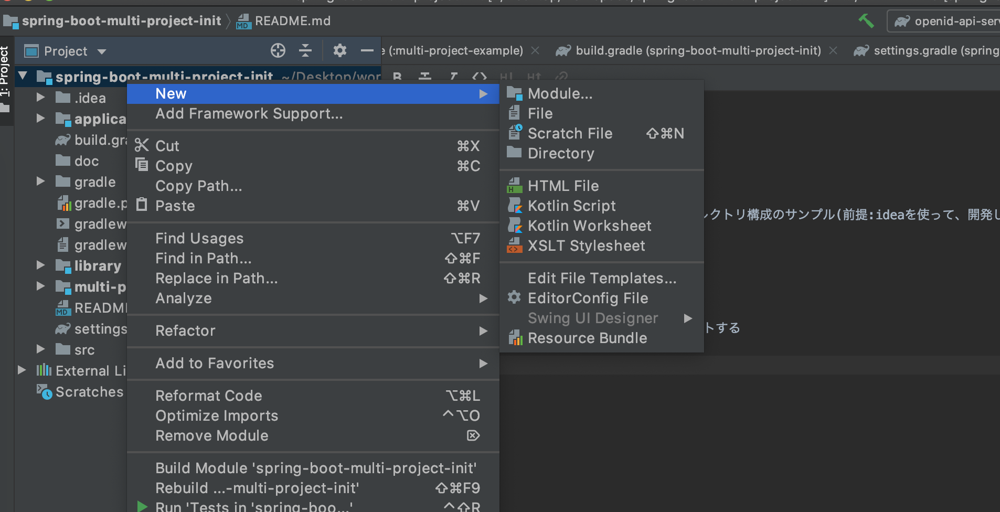

SpringBootのマルチプロジェクト
---


### 概要

* springbootのマルチプロジェクトのディレクトリ構成のサンプル(前提:ideaを使って、開発している)

### マルチプロジェクトを作成する手順

* git clone 本プロジェクト

* ideaを使って、本プロジェクトをインポートする

* [spring initializr](https://start.spring.io/)を使って、下記の項目を設定し、normalizeのディレクト構成を作成する

```shell script
ex :)
Group: multi.project
Artifact: example
Name: example
Package Name: multi.project.example
```

* ideaを使って、moduleを作成する(右クリック　→　New　→ Module)



```shell script
ex :)
Module Name: hello
```

* `spring initializr`を使って、作成したnormalizeディレクトリー中身の内容を`Module`に持っていく

* 本プロジェクトの`multi-project-example`を参考し、`hello` モジュールのファイルを修正する

```shell script
build.gradle
settings.gradle
```

### spring boot起動

```shell script
./graldew :multi-project-example:bootRun
```
